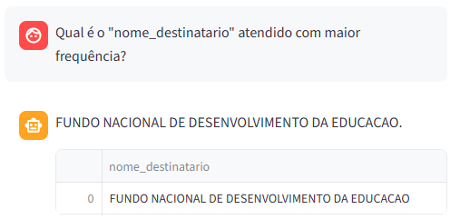
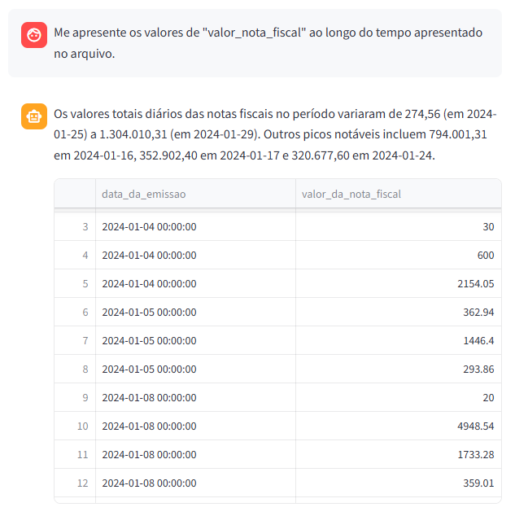
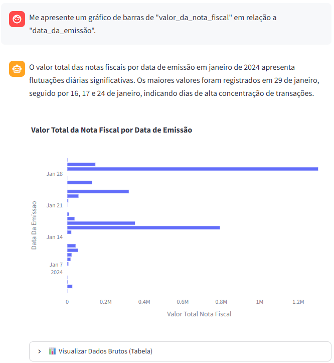
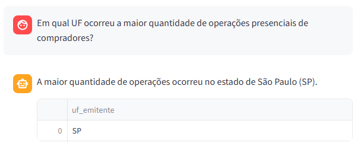

# Relatório Técnico
## Data Analytics Agent

**Projeto:** Desafio 04 — InsurMinds  
**Data:** 10 de Agosto de 2026  
**Repositório GitHub:** [data_analytics_agent](https://github.com/rodrigomdc/data_analytics_agent)

**Equipe:**

| Nome | E-mail |
|------|--------|
| Bruno Corrêa | correabruno321@gmail.com |
| Jhiovana Silva Ribeiro | jhiovanasilva11@gmail.com |
| Luis R G Pereira | luisrgpereira@gmail.com |
| Rodrigo Medeiros Costa | eng.rodrigomdc@gmail.com |
| Rodrigo Souza Aguiar | rodrigo_souza_aguiar@hotmail.com |

---

## 1. Framework Escolhido

O projeto utiliza **LangGraph** (parte do ecossistema **LangChain**) como framework principal de orquestração de agentes.

| Componente | Tecnologia / Versão |
|---|---|
| Framework de Agentes | **LangGraph** `>= 0.2.0` |
| Ecossistema de LLM | **LangChain** `>= 0.1.0` + `langchain-community` + `langchain-google-genai` |
| Modelo de Linguagem (LLM) | **Google Gemini 2.5 Flash** (via API Google AI) |
| Interface de Usuário | **Streamlit** `>= 1.30.0` |
| Banco de Dados Analítico | **DuckDB** `>= 0.10.0` |
| Visualização de Dados | **Plotly** `>= 5.18.0` |
| Manipulação de Dados | **Pandas** `>= 2.0.0` |
| Observabilidade | **LangSmith** |

O LangGraph foi escolhido por permitir a construção de fluxos de execução baseados em **grafos de estados dirigidos** (`StateGraph`), viabilizando o roteamento condicional entre nós especializados e o compartilhamento de um estado tipado (`AgentState`) entre todos os agentes do sistema.

---

## 2. Arquitetura da Solução

A aplicação é organizada em módulos independentes dentro do diretório `src/`, com separação clara de responsabilidades:

```
data_analytics_agent/
├── main.py                     # Ponto de entrada da aplicação
├── config.py                   # Configurações globais
├── requirements.txt            # Dependências do projeto
├── .env                        # Chave de API
├── .gitignore                  # Ignora arquivos sensíveis
├── database/data.duckdb        # Banco analítico local
├── uploads/                    # Recebe ZIP
├── extracted/                  # Armazena CSVs descompactados
└── src/
    ├── app/app.py              # Interface Streamlit
    ├── agents/agents_nodes.py  # Nós de agentes do LangGraph
    ├── graph/
    │   ├── builder.py          # Topologia e compilação do StateGraph
    │   └── orchestrator.py     # Entrada de execução do grafo
    ├── models/state_model.py   # Definição tipada do AgentState
    ├── prompts/prompts.py      # Prompts dos agentes
    ├── tools/tools.py          # Ferramentas (DuckDB, Plotly)
    ├── services/
    │   ├── ingestion_service.py  # Coordenador do pipeline ETL
    │   ├── zip_service.py        # Extração de ZIP
    │   ├── csv_service.py        # Carga de CSVs no DuckDB
    │   ├── data_dict_service.py  # Parser do dicionário de dados
    │   ├── analysis_service.py   # Análise preliminar
    │   └── query_service.py      # Validação e delegação
    ├── db_manager/duckdb_manager.py  # Gerenciador de conexões DuckDB
    ├── memory/conversation.py        # Memória de conversação
    └── utils/utils.py               # Funções utilitárias
```

### Diagrama em Camadas

```
┌────────────────────────────────────────────────────────┐
│              CAMADA DE APRESENTAÇÃO                    │
│  Streamlit (src/app/app.py)                            │
│  · Upload de ZIP  · Chat  · Tabelas  · Gráficos        │
└────────────────────────┬───────────────────────────────┘
                         │
┌────────────────────────▼───────────────────────────────┐
│                CAMADA DE SERVIÇOS                      │
│  ingestion_service · query_service · analysis_service  │
└────────┬───────────────────────────────────┬───────────┘
         │                                   │
┌────────▼──────────┐             ┌──────────▼───────────┐
│  CAMADA DE ETL    │             │  CAMADA DE AGENTES   │
│  zip_service      │             │  LangGraph (grafo)   │
│  csv_service      │             │  4 nós especializados│
│  data_dict_service│             │  AgentState (estado) │
└────────┬──────────┘             └──────────┬───────────┘
         │                                   │
┌────────▼───────────────────────────────────▼───────────┐
│              CAMADA DE DADOS / INFRAESTRUTURA          │
│  DuckDB (db_manager)  ·  Prompts  ·  Tools             │
│  ConversationMemory   ·  Cache local                   │
└────────────────────────────────────────────────────────┘
```

---

## 3. Descrição dos Agentes de Inteligência Artificial

O sistema é composto por **um único fluxo de agentes cooperativos**, implementados como nós de um `StateGraph` do LangGraph. Todos compartilham o mesmo objeto de estado (`AgentState`) e utilizam o modelo **Google Gemini 2.5 Flash**.

### 3.1 Agente Supervisor (`supervisor_node`)

- **Papel:** Orquestrador estratégico do fluxo. Analisa a intenção da pergunta do usuário e decide qual nó especialista deve ser acionado a seguir.
- **LLM:** Gemini 2.5 Flash (temperatura `0` — determinístico).
- **Entradas do estado:** `user_query`, `data_dict`, `schema`.
- **Saída:** `next_step` (`"analyze"` ou `"synthesize"`).
- **Como decide:** O supervisor recebe como contexto o dicionário de dados, o esquema físico do DuckDB e a pergunta do usuário. Seu prompt define regras estritas: qualquer pergunta que envolva cálculos, filtros, agregações ou visualizações deve ser roteada para `analyze`; perguntas conversacionais ou puramente conceituais vão diretamente para `synthesize`. A resposta do LLM é um JSON estruturado com o campo `next_step`.
- **Proteção:** Em caso de falha na chamada da LLM, o nó assume o fallback seguro `"analyze"`.

### 3.2 Agente Analista (`analyst_node`)

- **Papel:** Gerador de queries SQL. Interpreta a pergunta do usuário e escreve uma instrução SQL válida para DuckDB, executando-a e retornando o DataFrame resultante.
- **LLM:** Gemini 2.5 Flash (temperatura `0` — determinístico).
- **Entradas do estado:** `user_query`, `schema`, `data_dict`.
- **Saídas:** `sql_query`, `dataframe`.
- **Como decide:** O prompt instrui o modelo a usar o dicionário de dados para entender o significado semântico das colunas e o esquema físico para garantir que a query seja sintaticamente válida. A saída é uma query SQL limpa, sem blocos markdown. A ferramenta `query_duckdb_tool` valida a query contra comandos destrutivos (`DROP`, `DELETE`, etc.) antes da execução.
- **Delay preventivo:** Um `time.sleep(1.2)` é aplicado antes da chamada ao LLM para evitar o erro 429 (Rate Limit) da API do Google.

### 3.3 Agente de Gráficos (`chart_node`)

- **Papel:** Selecionador de visualização. Determina o tipo de gráfico mais adequado e seus parâmetros de eixos com base no DataFrame disponível e na intenção do usuário.
- **LLM:** Gemini 2.5 Flash (temperatura `0`).
- **Entradas do estado:** `dataframe`, `user_query`.
- **Saídas:** `chart_fig` (objeto Plotly), `chart_config` (JSON de parâmetros).
- **Como decide:** O prompt fornece ao LLM os nomes das colunas disponíveis na tabela extraída e a pergunta do usuário. O modelo retorna um JSON com `chart_type` (`bar`, `line`, `pie`, `scatter`), `x_col`, `y_col`, `color_col` e `title`. A ferramenta `create_chart_tool` usa esses parâmetros para gerar a figura Plotly com regras visuais automáticas (ex.: gráficos com mais de 8 categorias são convertidos para barras horizontais; gráficos de pizza com mais de 5 fatias são convertidos para barras).
- **Acionamento:** Este nó **não é roteado pelo supervisor**. É acionado por um roteador secundário após o nó Analista, que verifica palavras-chave de visualização na pergunta do usuário (`"gráfico"`, `"plot"`, `"barras"`, etc.).

### 3.4 Agente Sintetizador (`synthesis_node`)

- **Papel:** Redator de negócios. Transforma os dados tabulares e os metadados em uma narrativa explicativa concisa e direta, voltada ao usuário final.
- **LLM:** Gemini 2.5 Flash (temperatura `0.3` — levemente criativo).
- **Entradas do estado:** `user_query`, `dataframe` (serializado em Markdown), `data_dict`.
- **Saída:** `explanation` (texto final apresentado no chat).
- **Como decide:** O prompt estabelece que o agente deve atuar como analista de negócios, respondendo de forma objetiva apenas com os dados fornecidos na tabela. É proibido gerar código, JSON, parâmetros técnicos ou mencionar infraestrutura (SQL, DuckDB, agentes). A resposta deve ser direta, sem introduções genéricas.

---

## 4. Fluxo de Funcionamento da Aplicação

### 4.1 Fase 1 — Upload e Ingestão de Dados (ETL)

```
Usuário arrasta ZIP
        │
        ▼
[ZipService] Extrai arquivos para extracted/
        │
        ├──► [DataDictionaryService] Localiza e faz parser de dicionário
        │    (arquivos com "dicionario", "readme" ou "dict" no nome)
        │
        └──► [CSVService] Para cada arquivo .csv:
                - Detecta encoding
                - Detecta delimitador
                - Higieniza nomes de colunas
                - Registra tabela no DuckDB
        │
        ▼
[app.py] Atualiza session_state 
(db_ready=True, loaded_tables, data_dict)
        │
        ▼
Interface B (chat) é desbloqueada + Análise Preliminar é exibida
```

### 4.2 Fase 2 — Análise Preliminar Automática

Após o carregamento, a interface exibe automaticamente, para cada tabela:
- **Amostra `.head(5)`:** as cinco primeiras linhas da base.
- **Perfil Inteligente por Coluna** (`ColumnProfiler`): classifica cada coluna em um dos tipos `numerica`, `monetaria`, `categorica`, `data`, `identificador` ou `texto_livre`, exibindo estatísticas apropriadas para cada tipo.

### 4.3 Fase 3 — Consulta em Linguagem Natural (Grafo de Agentes)

```
Usuário digita pergunta no chat
        │
        ▼
[QueryService.process_query]
        │
        ├─[Validação Local]─► Tamanho < 3? Sem letras? 
        │                     Sem termos do vocabulário?
        │                      └─► Retorna erro sem chamar a API
        │
        ├─[Cache Lookup]─► Pergunta já foi feita antes?
        │                   └─► SIM: Re-executa SQL salvo +
        │                       reconstrói gráfico (0 tokens)
        │
        └─[Cache Miss]─► run_orchestrator_graph()
                │
                ▼
        [LangGraph — StateGraph]
                │
        ┌───────▼────────┐
        │   SUPERVISOR   │  ← Analisa intenção
        └───────┬────────┘
                │
        ┌───────┴───────────────┐
        │                       │
   next_step="analyze"    next_step="synthesize"
        │                       │
        ▼                       │
    ┌────────┐                  │
    │ANALISTA│ ← Gera SQL       │
    └───┬────┘                  │
        │                       │
   Detecta palavra-chave        │
   de gráfico na query?         │
        │                       │
   SIM ─┼─► ┌──────────────┐    │
        │    │CHART NODE   │    │
        │    └──────┬──────┘    │
        │           │           │
   NÃO ─┘           │           │
        └───────────┴───────────┘
                    │
                    ▼
            ┌───────────────┐
            │  SINTETIZADOR │ ← Redige explicação
            └───────┬───────┘
                    │
                    ▼
            Estado Final retornado:
            explanation + dataframe + chart_fig
                    │
                    ▼
        [Cache: grava SQL + explanation + chart_config]
                    │
                    ▼
        [ConversationMemory] Salva mensagem no session_state
                    │
                    ▼
        Interface exibe: texto + tabela + gráfico Plotly
```

### 4.4 Tratamento de Erros e Entradas Inválidas

| Situação | Tratamento |
|---|---|
| Pergunta muito curta (< 3 chars) | Validação local retorna mensagem orientativa |
| Pergunta sem palavras legíveis (`???`) | Validação local rejeita sem chamar a API |
| Pergunta sem relação com os dados | Validação com vocabulário dinâmico do esquema DuckDB |
| SQL inválida gerada pelo LLM | `PermissionError` com log + `dataframe = None` |
| SQL com comandos destrutivos | Bloqueio em `_validate_sql_safety` antes da execução |
| Falha no Supervisor | Fallback para o nó `"analyze"` |
| Falha ao gerar gráfico | Log de erro + fluxo continua para síntese sem gráfico |
| ZIP inédito já processado | Verificação por nome do arquivo (`loaded_zip_names`) |
| Arquivo sem dicionário de dados | Aviso amigável; agentes usam colunas físicas do esquema |

### 4.5 Segurança e Boas Práticas

- **Chave de API protegida:** o arquivo `.env` está listado no `.gitignore` e a chave é carregada via `python-dotenv` em `config.py`. Nenhuma credencial é exposta no código-fonte.
- **Banco de dados em modo leitura controlada:** a ferramenta `query_duckdb_tool` valida cada query SQL antes da execução, bloqueando comandos `DROP`, `DELETE`, `UPDATE`, `INSERT`, `ALTER`, `TRUNCATE` e `CREATE TABLE`.
- **Logging estruturado:** cada módulo instancia seu próprio logger nomeado via `setup_logger()`, registrando eventos de nível `INFO` e `ERROR` no console.
- **Cache local:** perguntas já processadas são reutilizadas sem nova chamada à API, reduzindo latência e consumo de tokens.
- **Sanitização de nomes:** nomes de tabelas e colunas são higienizados para `snake_case` ASCII puro, evitando erros de SQL por caracteres especiais ou acentuação.

---

## 5. Perguntas e respostas

### 5.1:



### 5.2:



### 5.3:



### 5.4:



---

## 6. Verificação dos Requisitos do Projeto

| Requisito | Status | Implementação |
|---|---|---|
| Upload de arquivo ZIP com um ou mais CSVs | ✅ Atendido | `ZipService` + widget `st.file_uploader` |
| Processamento automático dos arquivos enviados | ✅ Atendido | `DataIngestionService` (ETL completo) |
| Interface para perguntas em linguagem natural | ✅ Atendido | `st.chat_input` em `app.py` |
| Pelo menos um agente inteligente | ✅ Atendido | 4 nós agentes (Supervisor, Analista, Chart, Sintetizador) |
| Respostas corretas baseadas nos dados carregados | ✅ Atendido | Geração de SQL via LLM + execução no DuckDB |
| Respostas em texto, tabela ou gráfico | ✅ Atendido | `explanation` (texto) + `dataframe` (tabela) + `chart_fig` (Plotly) |
| Framework de agentes reconhecido | ✅ Atendido | **LangGraph** (LangChain) |
| Separação clara dos componentes | ✅ Atendido | Módulos `agents`, `services`, `tools`, `app`, `graph` |
| Projeto organizado em módulos | ✅ Atendido | 10 submódulos em `src/` |
| Prompts claros e objetivos | ✅ Atendido | `src/prompts/prompts.py` isolado |
| Tratamento de erros e perguntas inválidas | ✅ Atendido | `validate_user_query` + tratamentos por nó |
| Chaves de API e credenciais ocultas | ✅ Atendido | `.env` no `.gitignore` + `python-dotenv` |
| Código organizado e documentado | ✅ Atendido | Docstrings em todas as classes e métodos |

---